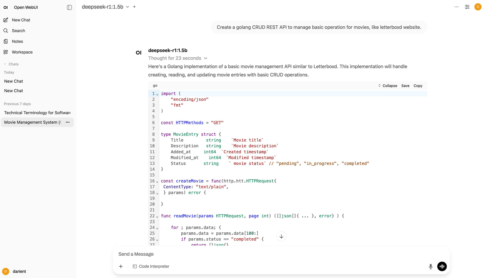
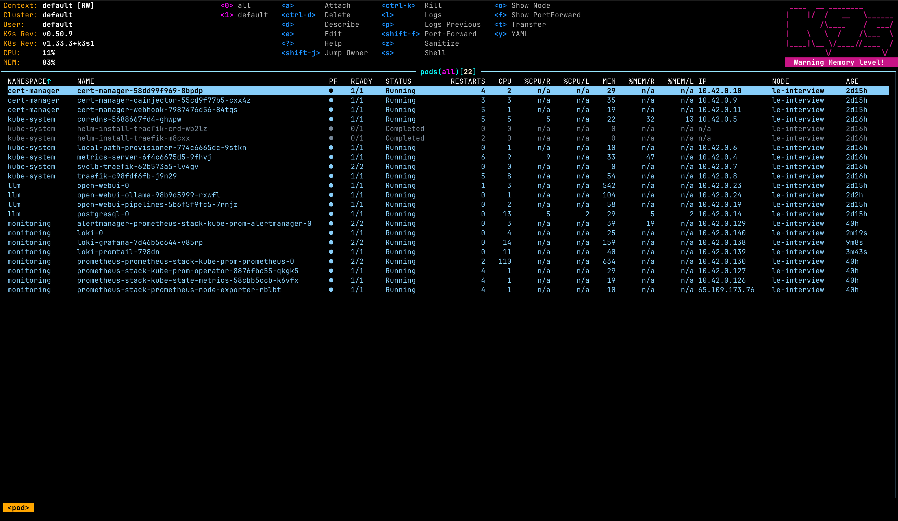
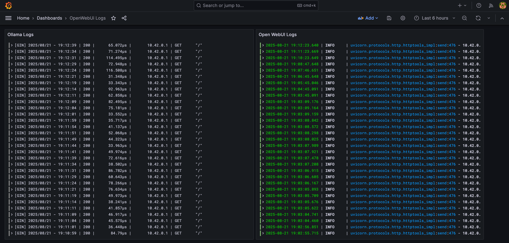
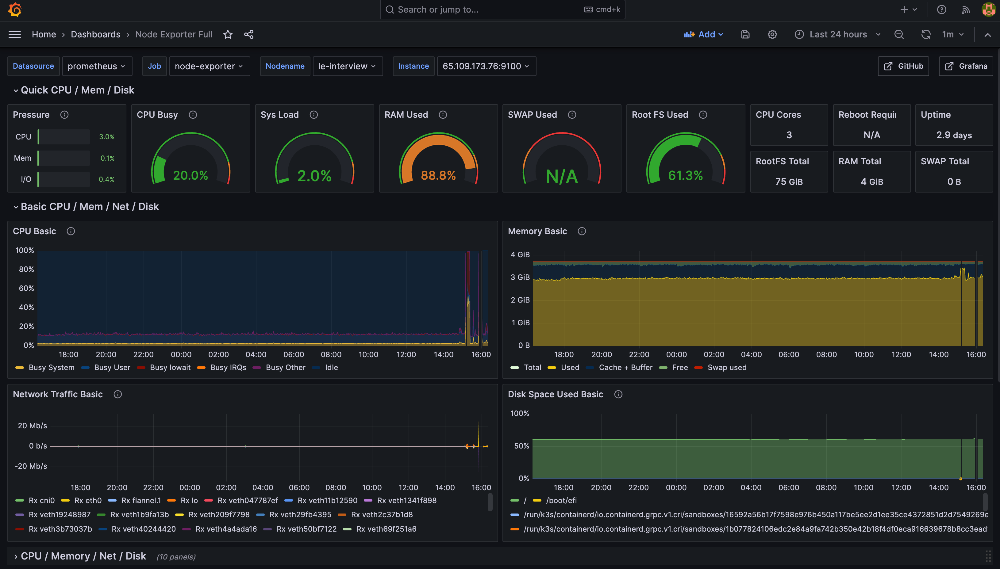

# Darien Tech DevOps test

## Instructions
The requested applications can be found at:
* https://devops-le.darienc.com
* https://devops-monitor-le.darienc.com/dashboard/

## Part 1
It consists of OpenWebUI with Ollama and a monitoring stack, with logs, metrics and alerts. All deployed with kubernetes and with a pipeline on GitHub Actions (in this repository) to automatically deploy everything.

### Main Components
The main components for this project is OpenWebUI, Ollama and a PostgreSQL instance to store all its data. All of them are running installed via helm, and we can see it's working in the URL and with the following image:


Access:
* https://devops-le.darienc.com
* User: `admin@darient.com`
* Password: `darient`

As the provided server is highly resource limited (4gb RAM) and 3 vCPU, the Ollama chat is having a hard time to work properly.

### Kubernetes
All application has been installed in Kubernetes. For this, I've used the k3s kubernetes distribution as it's most suited for this kind of environments.

The installation is simple and can be done with the following command:
```
curl -sfL https://get.k3s.io | sh -
```
You can have a preview of the cluster:


### Monitoring
For the monitoring side, I've decided to use Grafana + Prometheus + Loki + Alert Manager. This stack is useful as we can have both logs and metrics viewed centralized on Grafana. All of them has been installed with helm as well. Here's a preview of the dashboards:




Access:
* https://devops-le.darienc.com
* User: `admin`
* Password: `AiXETCCPwUVDfr3Ql11KmZiRglC9jLDBFFKWt3MQ`

There are alerts for the Ollama if memory usage is above 80% for more than 5 minutes, which has been setup with a Prometheus Rule.

### Security
All URLs have SSL certificates to access with HTTPS. They are managed via Let's Encrypt and Cert Manager.

### Deployment
A GitHub Actions workflow has been created to automatically deploy any changes made in the master branch. GitHub remotely connects to the cluster to do it.


## Part 2
