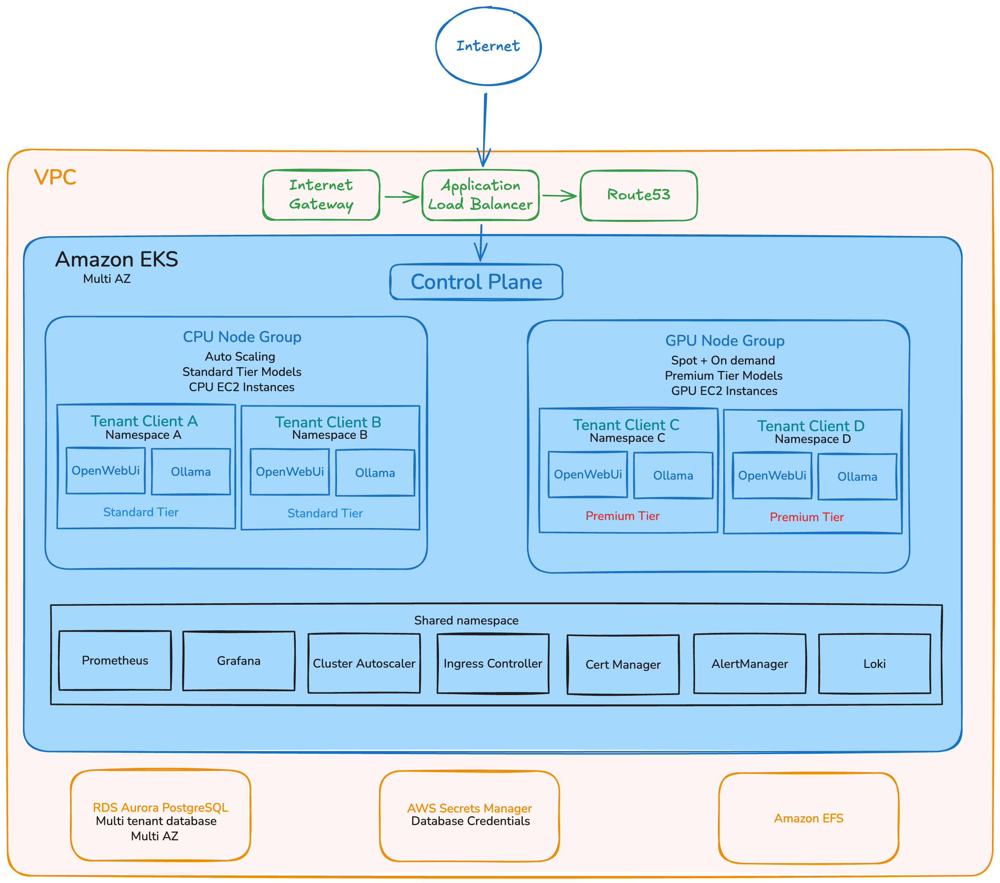

# Darien Tech DevOps test

## Instructions
The requested applications can be found at:
* https://devops-le.darienc.com
* https://devops-monitor-le.darienc.com/dashboard/

## Part 1
It consists of OpenWebUI with Ollama and a monitoring stack, with logs, metrics and alerts. All deployed with kubernetes and with a pipeline on GitHub Actions (in this repository) to automatically deploy everything.

### Main Components
The main components for this project is OpenWebUI, Ollama and a PostgreSQL instance to store all its data. All of them are running installed via helm, and we can see it's working in the URL and with the following image:


Access:
* https://devops-le.darienc.com
* User: `admin@darient.com`
* Password: `Darient123`

As the provided server is highly resource limited (4gb RAM) and 3 vCPU, the Ollama chat is having a hard time to work properly.

### Kubernetes
All application has been installed in Kubernetes. For this, I've used the k3s kubernetes distribution as it's most suited for this kind of environments.

The installation is simple and can be done with the following command:
```
curl -sfL https://get.k3s.io | sh -
```
You can have a preview of the cluster:


### Monitoring
For the monitoring side, I've decided to use Grafana + Prometheus + Loki + Alert Manager. This stack is useful as we can have both logs and metrics viewed centralized on Grafana. All of them has been installed with helm as well. Here's a preview of the dashboards:


Access:
* https://devops-monitor-le.darienc.com
* User: `admin`
* Password: `AiXETCCPwUVDfr3Ql11KmZiRglC9jLDBFFKWt3MQ`

There are alerts for the Ollama if memory usage is above 80% for more than 5 minutes, which has been setup with a Prometheus Rule.

### Security
All URLs have SSL certificates to access with HTTPS. They are managed via Let's Encrypt and Cert Manager.

### Deployment
A GitHub Actions workflow has been created to automatically deploy any changes made in the master branch. GitHub remotely connects to the cluster to do it.


## Part 2

### High Availability and Regional Scalability
* I chose AWS as main cloud provider as I have more experience with it, but other clouds can be taken in consideration for various features.
* Resilience to zone failure can be achieve using Multi AZ on the cloud resources where the applications will be hosted. Kubernetes (EKS), Database (RDS), Networking (Load Balancer), etc. can be set up as Multi AZ deployment.
* Horizontal Scaling will be setup on Kubernetes (Cluster Autoscaler) and on the pods (Horizontal Pod Autoscaler) so worker nodes  and pods can be added/removed based on the pod usage.

### Multiple Model Management and GPU Acceleration
The platform can split both tier by instance types on the node pools.
* Standard Tier (CPU) will use General Purpose instance types, like m5 instances, and will have Auto Scaling based on demand.
* Premium Tier (GPU) will use Accelerated Computing instances types, like P4/P5/P6, to support NVIDIA GPUs.
* Deployments will be configured with Labels and Tolerations to be placed on the correct node pool.

### Cost Optimization
* Spot instances can be used with a mixed approach, so we have instances for anytime but still with the majority of them as spot instances.

### Robust and Persistent Data Architecture
* Amazon RDS Aurora PostgreSQL can be used as database. We can have the benefit of having multiple read replicas in cluster mode.
* To store the models centralized, we can use Amazon EFS, so we can concurrent access for both tiers.

### Multi-Tenant Security and Governance
* Different namespaces on kubernetes can be used for each client, as several tenents.
* Network Policies will be setup so all access is blocked by default, and other policies will be created to allow based on the labels matching with the same tenant.
* AWS Secret Manager can be the best solution in this case. Kubernetes can sync the secrets with AWS and fetch the most up to date value.

### Advanced Observability
For observability, there are several possible solution, but I've sticked with:
* For metrics: Prometheus, Node Exporter, AlertManager.
* For graphs: Grafana.
* For Log Management: Promtail + Loki (CloudWatch could also be a solution).

### Diagram

